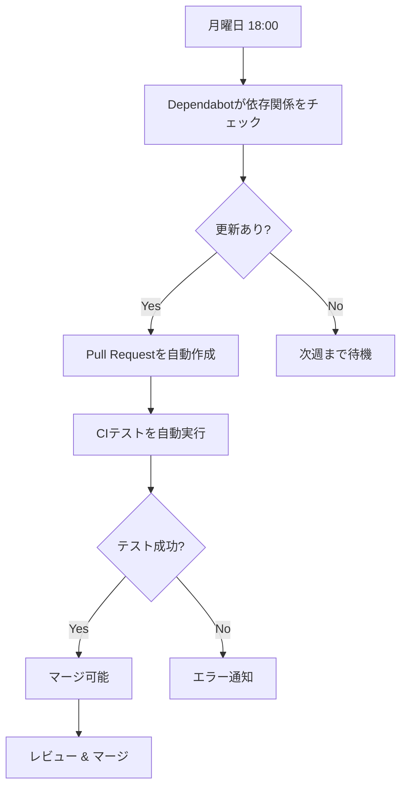

# Dependabot 設定ガイド

このプロジェクトでは、依存関係の自動更新に **GitHub Dependabot** を使用しています。

## 📋 概要

Dependabotは、GitHubが提供する依存関係の自動更新サービスです。定期的に依存関係をチェックし、更新があれば自動的にPull Requestを作成してくれます。

### 監視対象

1. **Go modules** (`go.mod`, `go.sum`)
   - gofeed
   - yaml.v3
   - その他のGoパッケージ

2. **GitHub Actions** (`.github/workflows/*.yml`)
   - actions/checkout
   - actions/setup-go
   - golangci/golangci-lint-action
   - その他のGitHub Actions

## ⚙️ 設定詳細

### スケジュール

- **実行頻度**: 毎週月曜日
- **実行時刻**: 18:00（日本時間）/ 09:00（UTC）
- **タイムゾーン**: `Asia/Tokyo`

### Pull Request設定

#### Go modules

- **最大PR数**: 5件
- **ラベル**: `dependencies`, `go`
- **コミットメッセージ**: `chore(deps): Update [パッケージ名]`
- **グループ化**:
  - パッチバージョン（例: 1.2.3 → 1.2.4）は1つのPRにまとめる
  - マイナーバージョン（例: 1.2.0 → 1.3.0）は1つのPRにまとめる
  - メジャーバージョン（例: 1.0.0 → 2.0.0）は個別のPR

#### GitHub Actions

- **最大PR数**: 3件
- **ラベル**: `dependencies`, `github-actions`
- **コミットメッセージ**: `chore(deps): Update [アクション名]`
- **グループ化**: すべての更新を1つのPRにまとめる

## 🔄 ワークフロー

### 自動更新の流れ



### Pull Requestの確認方法

1. GitHubリポジトリの「Pull requests」タブを開く
2. `dependencies` ラベルでフィルタリング
3. 各PRの詳細を確認：
   - 変更内容（CHANGELOG、リリースノート）
   - CIテストの結果
   - Breaking Changesの有無

### マージの判断基準

#### ✅ 自動マージして良い場合

- パッチバージョンの更新（バグフィックスのみ）
- CIテストがすべて成功
- Breaking Changesなし

#### ⚠️ 慎重に確認すべき場合

- マイナーバージョンの更新（新機能追加）
- メジャーバージョンの更新（Breaking Changes）
- GitHub Actionsの更新（ワークフローへの影響）

#### ❌ マージを避けるべき場合

- CIテストが失敗
- セキュリティ警告あり
- リリースノートに問題の報告あり

## 🛠️ カスタマイズ

### レビュアーの自動アサイン

`.github/dependabot.yml` に以下を追加：

```yaml
updates:
  - package-ecosystem: "gomod"
    # ... その他の設定 ...
    reviewers:
      - "your-username"
```

### アサイニーの自動設定

```yaml
updates:
  - package-ecosystem: "gomod"
    # ... その他の設定 ...
    assignees:
      - "your-username"
```

### 更新頻度の変更

```yaml
schedule:
  interval: "daily"    # 毎日
  # または
  interval: "monthly"  # 毎月
```

### 特定のパッケージを無視

```yaml
ignore:
  # gofeedの更新を無視
  - dependency-name: "github.com/mmcdole/gofeed"
    versions: ["1.x"]
```

## 📊 統計情報の確認

### Dependabot Insights

1. リポジトリの「Insights」タブを開く
2. 左サイドバーの「Dependency graph」を選択
3. 「Dependabot」タブで統計を確認

確認できる情報：
- 作成されたPR数
- マージされたPR数
- クローズされたPR数
- 平均マージ時間

## 🔒 セキュリティアラート

Dependabotは脆弱性も検出します：

### 有効化方法

1. リポジトリの「Settings」タブを開く
2. 「Security & analysis」セクション
3. 以下を有効化：
   - **Dependabot alerts**: 脆弱性の検出
   - **Dependabot security updates**: 脆弱性の自動修正

### セキュリティアラートへの対応

1. 「Security」タブでアラートを確認
2. 深刻度（Critical/High/Medium/Low）を確認
3. Dependabotが作成した修正PRをレビュー
4. 可能な限り早くマージ

## 🎯 ベストプラクティス

### 1. 定期的なレビュー

- 週に1回はDependabot PRを確認
- 放置せず、速やかにマージまたはクローズ

### 2. テストの充実

- CIテストのカバレッジを高める
- 自動テストで問題を早期発見

### 3. リリースノートの確認

- メジャー/マイナー更新は必ずリリースノートを確認
- Breaking Changesに注意

### 4. グループ化の活用

- 関連する更新は1つのPRにまとめる
- レビューの手間を削減

### 5. セキュリティアラートの優先

- セキュリティ関連のPRは最優先でマージ
- Critical/Highは24時間以内に対応

## 🆘 トラブルシューティング

### Dependabotが動作しない

**原因1**: 設定ファイルの構文エラー

```bash
# 設定ファイルを検証
cat .github/dependabot.yml
```

**原因2**: リポジトリの権限不足

- Settings > Code security and analysis > Dependabot が有効か確認

**原因3**: ブランチ保護ルールの競合

- ブランチ保護ルールを確認
- Dependabotが書き込み可能か確認

### PRが自動クローズされる

**原因**: 競合する更新

- 手動で依存関係を更新した場合、DependabotのPRは自動クローズされます
- 問題ありません（正常な動作）

### マージ後も新しいPRが作成される

**原因**: 段階的な更新

- Dependabotは安全のため、段階的に更新します
- 例: 1.0.0 → 1.1.0 → 1.2.0（一度に1.2.0にはしない）

## 📚 参考資料

- [Dependabot公式ドキュメント](https://docs.github.com/ja/code-security/dependabot)
- [dependabot.yml設定リファレンス](https://docs.github.com/ja/code-security/dependabot/dependabot-version-updates/configuration-options-for-the-dependabot.yml-file)
- [Dependabotのベストプラクティス](https://docs.github.com/ja/code-security/dependabot/working-with-dependabot)

## 💡 Tips

### 手動で依存関係を更新

Dependabotを待たずに手動で更新することも可能です：

```bash
# すべての依存関係を最新化
go get -u ./...
go mod tidy

# 特定のパッケージのみ更新
go get -u github.com/mmcdole/gofeed@latest
go mod tidy

# テストを実行
make test

# 問題なければコミット
git commit -am "chore(deps): Update dependencies manually"
git push
```

### Dependabotを一時停止

緊急時やリリース前などに一時停止できます：

1. リポジトリの「Insights」タブ
2. 「Dependency graph」 > 「Dependabot」
3. 各エコシステムの「Pause」ボタン

---

**注意**: このドキュメントは `.github/dependabot.yml` の設定と連動しています。設定を変更した場合は、このドキュメントも更新してください。

